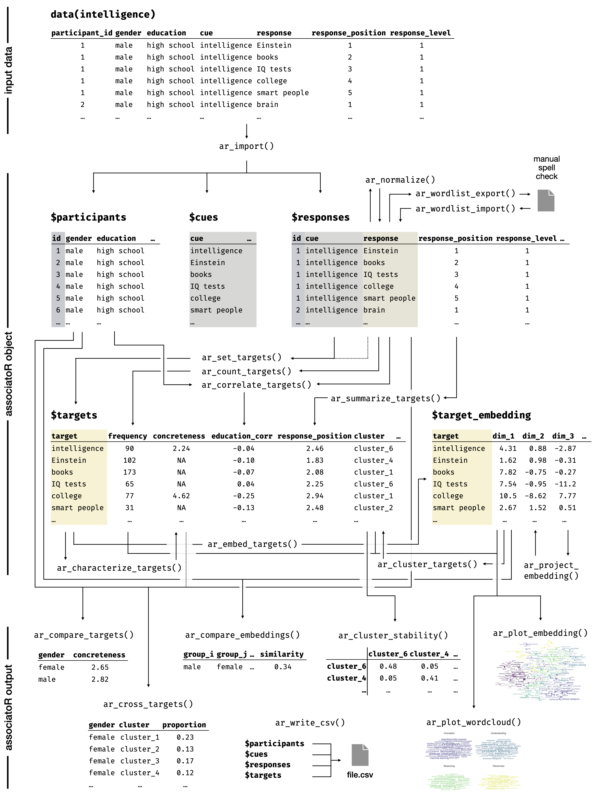

# associatoR

Associations offer a window into the mind, revealing how words, concepts, and topics are represented. They can be used to map how people think about key social and technological issues.

`associatoR` is an R package for analyzing free association data. It covers the entire analysis pipeline, from importing and processing to embedding, clustering, and visualizing the data.

## Installation

The latest development version on GitHub can be installed via `devtools::install_github("samuelae/associatoR")`. This may require prior installation of the `devtools` package via `install.packages("devtools")`.

## Team and Citation

The `associatoR` package is developed by [Samuel Aeschbach](https://github.com/samuelae) and [Dirk U. Wulff](https://github.com/dwulff), with contributions from [Rui Mata](https://github.com/matarui).

Please cite the package as:

Aeschbach, S., Mata, R., & Wulff, D. U. (2025). Mapping Mental Representations With Free Associations: A Tutorial Using the R Package associatoR. Journal of Cognition, 8(1), Article 3. <https://doi.org/10.5334/joc.407>

## Overview

The figure below provides an overview of core functions and workflows of the `associatoR` package based on the example presented in [Aeschbach, Mata, and Wulff (2025)](https://doi.org/10.5334/joc.407>).

